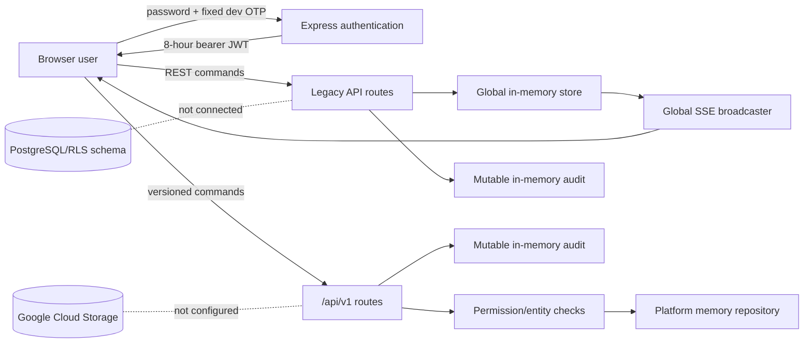
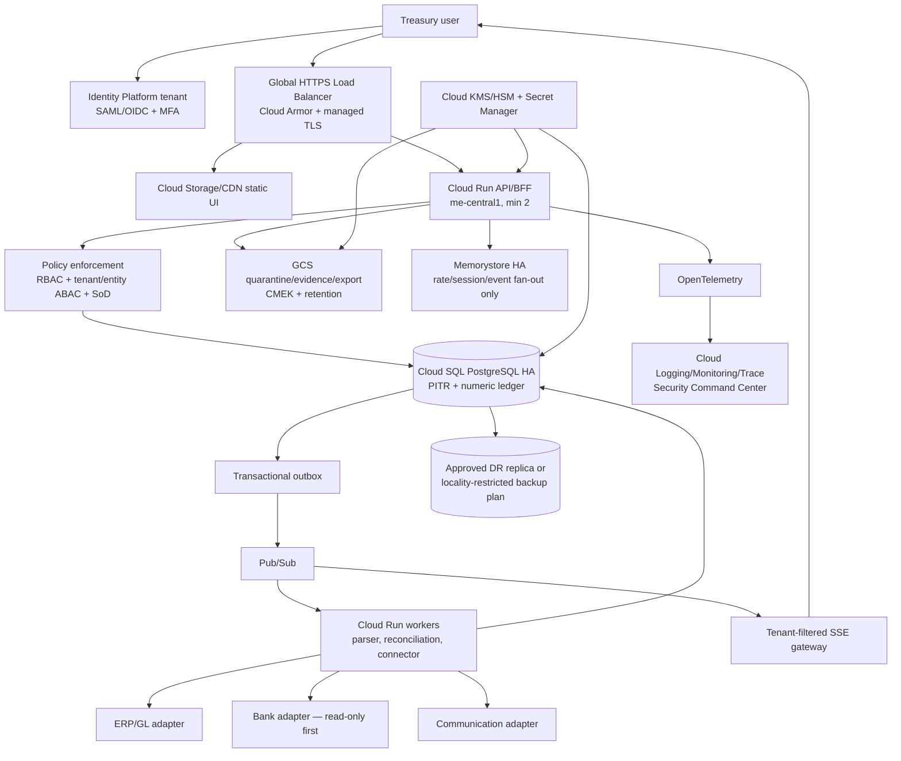

# Treasury Atom production audit and rebuild blueprint

**Audit date:** 2026-09-06  
**Scope:** repository state at commit `008fd48`  
**Phase:** 1 — evidence-based blueprint  
**Release decision:** **NO-GO for production financial data or external mutations**

## 1. Executive summary

Treasury Atom is a useful interaction prototype and modular-monolith starting point, but it is not yet a deployable treasury system of record. The React/Vite client, Express API, authenticated SSE, repository abstraction, permission vocabulary, PostgreSQL schema, RLS foundation, health endpoints, and automated tests are positive foundations. The runtime still uses process memory, development identity, non-tenant legacy routes, global SSE fan-out, and non-durable audit/idempotency controls.

Four release-blocking conditions require remediation before any production financial record is accepted:

1. The OTP verifier accepts the fixed development fallback code when `DEV_OTP` is absent, including production. The documented `AUTH_SECRET` is not read by the server, which expects `JWT_SECRET` and silently creates a new random key.
2. Legacy API reads and mutations operate on a global in-memory store without tenant/entity authorization. SSE broadcasts one global snapshot to every authenticated connection.
3. Financial state, idempotency responses, authentication challenges, and audit events disappear on process restart and are not transactionally consistent.
4. Neither the runtime nor repository has an approved Google Cloud production topology, durable queue/outbox, immutable evidence store, recovery procedure, or tested deployment pipeline.

`npm audit --omit=dev` reported zero known production dependency vulnerabilities across 231 production dependencies on the audit date. This does not replace SAST, secret scanning, container scanning, penetration testing, or dependency-policy enforcement.

## 2. Decisions required from the owner

| Decision | Provisional blueprint assumption | Production consequence |
|---|---|---|
| Data residency | `me-central1` (Doha) primary | Google Cloud does not currently list a UAE region. UAE-only residency cannot be claimed. |
| Disaster recovery | `me-central2` (Dammam), asynchronous | Cross-border replication requires legal/compliance approval; otherwise use same-region backup and accept a longer regional-outage RTO. |
| Workforce authentication | Google Cloud Identity Platform tenant + customer SAML/OIDC; phishing-resistant MFA for privileged roles | Replaces local password/OTP and creates an identity tenant boundary. |
| Availability | Tier 2 internal finance: 99.9% monthly; close-window target 99.95% | Determines minimum instances, database HA, support rota, and cost. |
| Recovery | Zonal RTO ≤15 min/RPO 0; regional RTO ≤4 h/RPO ≤15 min | Must be confirmed by finance and risk owners. |
| Audit retention | Seven years, subject to legal review | Bucket Lock is irreversible after locking; legal owner must approve duration. |
| Payment authority | Propose-only; no bank payment initiation in the initial production release | Any future release requires a separately certified mutation service and maker-checker control. |

## 3. System boundary and present data flow

### In scope

- React 19/Vite client, navigation, treasury workspaces, visual state, authenticated REST and SSE client.
- Express 5 API, authentication middleware, legacy treasury routes, versioned platform routes, policy vocabulary, reconciliation logic, audit events, and development repositories.
- Supabase/PostgreSQL DDL and RLS migrations as design evidence only; they are not wired into the runtime.
- Automation governance manifests, environment contract, build/test scripts, and deployment documentation.
- Planned bank statement, ERP/GL, evidence-storage, communication, billing, and identity integrations.

### Out of scope until contracts exist

- Real bank credentials or payment initiation.
- A claim of automated GL posting or automated close.
- A production AI/SOP agent runtime.
- PCI cardholder-data processing.
- Customer.io message delivery and KRIBA escrow execution.

### Current flow



## 4. NFR and assurance baseline

The production release must meet **OWASP ASVS 5.0 Level 2**, with Level 3 requirements applied to authentication, access control, cryptography, business logic, files, logging, and high-value mutations. Threat modeling uses STRIDE and maps operational detection coverage to relevant MITRE ATT&CK techniques. Controls must also be mapped to the organization’s applicable UAE PDPL, DIFC/ADGM privacy, record-retention, sanctions, banking, and audit obligations by qualified counsel; this document does not make a compliance certification.

| Quality | Production target | Verification |
|---|---|---|
| Tenant isolation | Zero cross-tenant reads/writes/events | Automated negative matrix across every API, object path, job, export, and event stream |
| Financial correctness | 100% conservation of debits/credits; no binary floating point | Property tests, double-entry constraints, decimal-string API contracts |
| Command integrity | Exactly one committed effect per idempotency key and request hash | Concurrent retry/timeout tests against PostgreSQL |
| Read latency | p95 ≤300 ms, p99 ≤750 ms at agreed peak | k6 load test with production-like tenant/cardinality profile |
| Command latency | p95 ≤750 ms excluding external provider settlement | OpenTelemetry traces and k6 thresholds |
| Availability | 99.9%; 99.95% during configured close window | Cloud Monitoring SLO and error-budget policy |
| Audit | Every material decision has actor, tenant, correlation, before/after hash, policy version, timestamp | Reconciliation completeness query and immutable archive verification |
| Accessibility | WCAG 2.2 AA; full keyboard operation; reduced motion | axe-core, Playwright, manual screen-reader and keyboard checks |
| Recovery | Zonal RTO ≤15 min/RPO 0; provisional regional RTO ≤4 h/RPO ≤15 min | Quarterly restore and annual regional failover exercise |

## 5. Detailed findings

### Risk register

| ID | Severity | Affected components | Evidence | Required remediation |
|---|---|---|---|---|
| TA-001 | Critical | Authentication | `server/src/services/auth.ts:8-10`; `.env.example:4` | Remove fallback OTP in production; require startup-validated configuration; replace local auth with Identity Platform SAML/OIDC and MFA; short-lived tokens with issuer/audience/key rotation. |
| TA-002 | Critical | Tenant isolation, SSE | `server/src/app.ts:135,171-307`; `server/src/routes/treasuryStream.ts:6-24` | Put `tenant_id` in trusted identity context; enforce policy on every repository query; partition event channels and snapshots by tenant/entity; add cross-tenant tests. |
| TA-003 | Critical | Persistence and integrity | `server/src/store/memoryStore.ts`; `server/src/modules/platform/memoryRepository.ts` | Replace runtime memory repositories with PostgreSQL transactions; remove seed/reset endpoints from production; implement migration and backup gates. |
| TA-004 | Critical | Financial commands | `server/src/app.ts:185-266`; platform idempotency map | Require permission, tenant, approval policy, request hash, durable idempotency record, and atomic outbox in the same database transaction. |
| TA-005 | High | Authorization | `accessForRole()` grants two fixed legal entities to every user; legacy routes check authentication but not permissions | Resolve memberships server-side per request/session; separate viewer, preparer, approver, release operator, auditor, and tenant admin; deny by default. |
| TA-006 | High | RLS / segregation of duties | Supabase policies use `FOR ALL` for any member | Replace membership-only policies with operation-specific role predicates; prevent maker from approving own command; restrict audit insertion to trusted service identity. |
| TA-007 | High | Audit/evidence | In-memory audit is mutable; database receipt JSON is not chained/signed; client can insert audit rows under current grants | Server-only audit writer; canonical event schema; SHA-256 hash chain per tenant; daily signed manifest; Cloud Storage retention policy/Bucket Lock after legal approval. |
| TA-008 | High | Money and reconciliation | Legacy API accepts JavaScript `number`; updates mutate objects; no ledger balancing transaction | Decimal strings at boundary; PostgreSQL `numeric`; immutable journal entries with reversing entries; reconciliation version and optimistic concurrency. |
| TA-009 | High | API edge | `cors({ origin: true })`; no security headers, rate limit, payload-specific quotas, or abuse controls | Explicit allowlist; Cloud Armor; Helmet/CSP; per-principal/IP rate limits; request-size/content-type controls; login throttling and lockout. |
| TA-010 | High | Onboarding | Public signup creates a treasury role; no verified invitation or tenant binding | Invitation-only onboarding, domain/IdP verification, four-eyes privileged-role approval, lifecycle/deprovisioning webhook. |
| TA-011 | High | File ingestion | No production parser, malware scan, quarantine, deduplication, or evidence object policy | Signed resumable upload to quarantine bucket; MIME/magic validation; malware scanning; SHA-256 dedupe; parser version and human review. |
| TA-012 | High | Cloud/SDLC | No Terraform, Cloud Build/GitHub Actions security gates, artifact provenance, SBOM, or image scanning | Establish landing zone and IaC; pinned build; SLSA provenance; Artifact Registry scanning; gated promotion and rollback. |
| TA-013 | Medium | Idempotency | `Map` cache is process-local, unbounded, not payload-bound, and not concurrency-safe | PostgreSQL unique `(tenant, operation, key)` plus request hash, response, status, expiry, and transaction lock. |
| TA-014 | Medium | Observability/IR | Console errors and coarse health; no structured audit/metrics/traces/on-call policy | OpenTelemetry, structured redacted logs, Cloud Logging/Monitoring, trace propagation, SLOs, alert routes, incident playbooks. |
| TA-015 | Medium | SaaS platform | No durable onboarding, billing, entitlements, feature flags, quota accounting, or tenant lifecycle | Entitlement service/table; Stripe or approved billing adapter; server-side flags; usage ledger; suspend/export/delete workflows. |
| TA-016 | Medium | SOP agents | Governance YAML documents propose-only intent, but no durable agent runs, tool grants, evidence bundle, evaluation, or kill switch | Agent-run state machine, allowlisted tools, scoped service accounts, deterministic policy checks, timeout/retry, human approval, evaluation suite. |
| TA-017 | Medium | DR | No backup/failover configuration or tested restore | Cloud SQL HA + PITR; approved cross-region replica or locality-restricted plan; immutable exports; rehearsed runbooks. |
| TA-018 | Low | Supply chain visibility | Runtime audit is clean, but gitleaks, Trivy, Semgrep and Terraform are not installed locally | Enforce centrally in CI; do not rely on developer workstation availability. |

### Design and coupling

- The modular monolith is the correct near-term pattern. Splitting into many microservices before durable domain boundaries and observability exist would increase failure modes.
- `server/src/app.ts` mixes authentication, HTTP validation, orchestration, persistence, audit, export, and reconciliation. Phase 2 separates transport, application commands, domain rules, and adapters while retaining one deployable API initially.
- There are two parallel domain stores and route families with different safety properties. Phase 2 removes the legacy mutation path after compatibility tests.
- The repository abstraction is a useful seam, but it must expose transaction and tenant-scoped methods, not a mutable `state` object.

### Data lineage, ownership, and consistency

Each imported statement and transaction needs: tenant, legal entity, account, source system, source object generation, object SHA-256, parser/version, ingest run, original row coordinates, normalized value, validation result, reviewer, and timestamps. The Treasury Data Owner owns canonical definitions; Integration Owners own source contracts; Security owns classification/key policy; Finance Control owns reconciliation and close rules.

Bank import, normalization, reconciliation, journal proposal, approval, posting, and audit publication form a process manager/saga. Database changes and outbox publication are atomic. External posting remains eventually consistent and must expose `pending`, `acknowledged`, `settled`, `failed`, and `compensating_review` states; it must never be represented as committed merely because a request was sent.

### SaaS controls

- Identity tenant and application tenant IDs are mapped explicitly; they are never accepted from a browser header without server verification.
- PostgreSQL shared-schema tenancy is acceptable initially only with mandatory `tenant_id`, RLS, service-layer policy, and isolation tests. Offer dedicated project/database tiers later for regulated customers.
- Feature flags and entitlements are server-evaluated and included in audit events. Billing measures immutable usage facts, not UI activity.
- Tenant provisioning is asynchronous and idempotent: identity tenant → organization → keys → storage prefixes/buckets → roles → baseline policy → validation → activation.

## 6. STRIDE threat model summary

| Threat | Representative abuse case | Primary controls | Verification |
|---|---|---|---|
| Spoofing | Fixed OTP or stolen long-lived JWT | SAML/OIDC, WebAuthn/FIDO2 MFA, token audience/issuer, revocation, re-auth for approval | Authentication abuse and replay tests |
| Tampering | Change amount/status after review | Immutable command payload hash, optimistic version, signed approval token, append-only journal | Before/after hash and race tests |
| Repudiation | Approver denies release | Trusted server timestamp, actor/IdP session, policy version, chained receipt, immutable archive | Receipt reconstruction exercise |
| Information disclosure | Tenant A receives Tenant B snapshot/export | Tenant-aware repositories, RLS, event partitioning, object-prefix IAM, VPC-SC | Automated isolation matrix |
| Denial of service | Login/SSE/upload exhaustion | Cloud Armor, quotas, connection caps, backpressure, bounded parsers, circuit breakers | k6 and fault-injection tests |
| Elevation of privilege | Preparer becomes approver or uses public signup | Invitation workflow, ABAC/RBAC, SoD constraints, privileged access approval | Permission matrix and negative tests |

Agent-specific threats include prompt injection in uploaded evidence, tool-call parameter smuggling, data exfiltration through provider prompts, model/provider substitution, and autonomous mutation. The agent receives sanitized evidence references rather than unrestricted object access, providers are allowlisted per data class and region, outputs are treated as untrusted proposals, and external mutations require a non-AI policy decision plus human approval.

### ATT&CK-informed detection cases

| Technique | Treasury Atom signal | Detection/response requirement |
|---|---|---|
| T1110 Brute Force | Repeated login/challenge failures across accounts or IPs | Rate limit, risk scoring, account protection, alert and IdP investigation |
| T1078 Valid Accounts | New device/ASN uses privileged role or performs abnormal export/approval | Step-up authentication, session revocation, entity-aware anomaly alert |
| T1098 Account Manipulation | Membership, role, IdP, or recovery method changes | Dual approval for privilege changes and immutable identity audit |
| T1190 Exploit Public-Facing Application | WAF/DAST/runtime validation detects malicious request patterns | Cloud Armor block, isolate revision, preserve evidence, patch gate |
| T1565.001 Stored Data Manipulation | Statement, ledger, policy, or evidence digest changes unexpectedly | Generation/hash checks, immutable journal, audit-chain alert, close freeze |
| T1567 Exfiltration Over Web Service | Unapproved bulk export, provider prompt, or object download | DLP/classification policy, egress allowlist, VPC-SC, revoke session and keys |
| T1499 Endpoint Denial of Service | SSE, upload, parser, or API quota exhaustion | Connection caps, bounded work queues, circuit breakers, Cloud Armor, graceful degradation |

## 7. Target Google Cloud architecture



Use separate `bootstrap`, `security`, `shared`, `nonprod`, and `prod` projects under an organization/folder hierarchy. Workloads use dedicated service accounts and Workload Identity; no service-account keys. Private Service Connect/VPC access protects managed data services. VPC Service Controls protect Storage, secrets, keys, logs, and analytics where supported. Production has no direct developer write access.

### Storage strategy

- Quarantine bucket: regional, CMEK, no public access, short lifecycle, scanner-only promotion.
- Evidence bucket: regional, uniform bucket-level access, per-tenant object naming, generation preconditions, checksums, object versioning, approved retention.
- Audit archive: separate security project and key, writer-only service account, daily manifest, Bucket Lock only after Legal approves irreversibility and duration.
- Export bucket: short TTL, one-time signed URL, tenant/user-bound export record, download audit.

## 8. Integration contracts and provisional SLOs

| Integration | Mode | Timeout/retry | SLO | Failure behavior |
|---|---|---|---|---|
| Bank statements | Read-only file/API ingest | 30 s request; exponential retry for 24 h | 99.5% accepted files normalized or placed in review within 5 min | Quarantine; never alter prior ledger |
| ERP/GL | Outbox-driven proposal/posting | 10 s call; bounded retry + dead-letter | 99.9% accepted commands acknowledged within 15 min | `pending/failed`; no false posted status |
| Evidence storage | Signed upload + async scan | resumable; generation precondition | 99.9% uploads durably recorded | quarantine and block workflow |
| Communication | Template preview first | 10 s; provider idempotency key | 99.5% approved messages handed off in 5 min | preserve approval, show delivery unknown/failed |
| AI providers | Propose-only | 15 s; one safe alternate if policy permits | 99% response or explicit unavailable result | deterministic workflow continues without AI |
| Identity | SAML/OIDC | provider defaults + circuit breaker | 99.9% authentication availability | existing short session policy; no local bypass |

Final SLAs belong in signed provider and internal operational agreements; the numbers above are design inputs, not guarantees.

## 9. Phase 2 implementation plan

| Milestone | Target | Accountable owner | Deliverable | Exit criteria |
|---|---:|---|---|---|
| M0: decisions and freeze | Week 1 | Product + CISO + Finance Control + Legal | Residency, identity, RTO/RPO, retention, mutation authority signed | All decision rows in section 2 approved |
| M1: secure foundation | Weeks 1–3 | Cloud Platform/Security | Terraform landing zone, CI identity, KMS, secrets, logging, Artifact Registry | Policy-as-code and infrastructure tests pass; no long-lived cloud keys |
| M2: identity and tenancy | Weeks 2–5 | IAM + Backend | Identity Platform tenant flow, memberships, RBAC/ABAC/SoD, tenant context | Complete cross-tenant negative matrix passes |
| M3: durable core | Weeks 4–8 | Backend + Data | Cloud SQL repository, decimal contracts, ledger, durable idempotency/outbox/audit | Restart/concurrency/property tests pass; zero lost/duplicate effects |
| M4: ingestion/reconciliation | Weeks 6–10 | Treasury Engineering | Quarantine pipeline, CSV/XLSX validators, evidence lineage, versioned reconciliation | Golden-file and malformed-file suite passes; 100% lineage coverage |
| M5: integrations and agents | Weeks 8–12 | Integration + AI Governance | Read-only bank/ERP adapters, agent run state machine, kill switch, evaluation | Contract/failover tests pass; agent cannot mutate directly |
| M6: SaaS and operations | Weeks 10–14 | Platform + SRE | Onboarding, entitlements, billing adapter, flags, SLOs, backup/restore | Tenant provisioning and restore exercises pass |
| M7: assurance/pilot | Weeks 14–16 | QA + Independent Security + Finance | Load/chaos/penetration/UAT evidence and pilot close | No Critical/High findings; finance and security sign-off |

### Proposed module boundaries

```text
identity/       trusted principal and session verification
tenancy/        organization, membership, role, entity scope, entitlement
ingestion/      upload, quarantine, parser, validation, lineage
cash/           accounts, statements, normalized transactions
ledger/         immutable journals, periods, balances, reversals
reconciliation/ candidates, decisions, exceptions, versions
close/          periods, checklist, evidence requirements, sign-off
approvals/      maker-checker policy, payload hash, expiry, execution token
integrations/   bank, ERP/GL, communication provider adapters
agents/         runs, evidence bundle, model route, tools, evaluation, halt
audit/          canonical receipt, hash chain, archive manifest
platform/       idempotency, outbox, jobs, flags, metering, observability
```

The initial deployment remains a modular monolith plus workers. Services split only when scaling, ownership, compliance, or failure isolation justifies it.

## 10. UI/UX production frame

The existing white finance-grade shell can remain. Production UX work focuses on operational truth:

1. Persistent environment, tenant, legal entity, balance date, freshness, and source badges.
2. Data connection center backed by connector health APIs—not static status copy—with last success, SLA, lag, owner, and incident link.
3. Reconciliation workbench with evidence preview, match rationale, version, preparer/approver separation, and accessible keyboard actions.
4. Approval center showing immutable payload digest, policy result, conflicts, expiry, and explicit step-up authentication.
5. Close cockpit with dependency graph, blocking evidence, owner/due date, readiness rules, and signed close pack.
6. Degraded/offline/error states that never display stale numbers as current; every value exposes source and as-of time.

No UI control may imply a live connection, posted journal, sent message, moved money, or completed close unless the backend returns verifiable evidence for that state.

## 11. Test and verification strategy

- Unit: decimal arithmetic, matching rules, authorization predicates, state machines, canonical hashing.
- Property: balanced ledger, reversals, idempotency, ordering, duplicate ingestion, currency precision.
- Contract: OpenAPI provider/consumer tests for each bank, ERP, identity, and communication adapter.
- Integration: ephemeral PostgreSQL and GCS-compatible test bucket; real migrations; transaction rollback; outbox delivery.
- Isolation: every operation attempted across tenants, entities, object paths, exports, events, caches, jobs, logs, and support tooling.
- External data: approved synthetic/minimized statements in a dedicated non-production tenant; checksum manifest; no production credentials; replayable golden files.
- Non-destructive production validation: read-only canary tenant, shadow parsing, compare-only reconciliation, feature flag off, no external mutation scope.
- Security: ASVS traceability, Semgrep/CodeQL, Gitleaks, OSV/Dependabot, Trivy, Checkov/tfsec, DAST, independent penetration test.
- Performance: k6 workloads for login, dashboard, import, reconciliation, export, and 1,000 concurrent event clients with tenant partition assertions.
- Resilience: dependency latency/errors, duplicate Pub/Sub delivery, worker crash, database failover, lost Redis, expired approval, regional recovery.

The detailed operator procedure is in [verification-runbook.md](verification-runbook.md).

## 12. Phase 2 release gates

Phase 2 may enter production only when:

- All Critical and High findings are closed with test evidence and independent review.
- Residency, retention, identity, RTO/RPO, and payment-authority decisions are signed.
- Restore and tenant-isolation tests have passed in the release candidate environment.
- Every material command is durable, idempotent, tenant-scoped, authorized, audited, and reversible or compensatable.
- The agent runtime remains propose-only unless a separately approved mutation capability is implemented.
- Finance Control, Security, Legal/Privacy, SRE, and Product approve the go-live record.

## References

- [OWASP Application Security Verification Standard 5.0](https://owasp.org/www-project-application-security-verification-standard/)
- [Google Cloud financial-services security perspective](https://docs.cloud.google.com/architecture/framework/perspectives/fsi/security)
- [Google Cloud security foundations blueprint](https://docs.cloud.google.com/architecture/blueprints/security-foundations/summary)
- [Google Cloud locations](https://cloud.google.com/about/locations)
- [Cloud Run locations](https://docs.cloud.google.com/run/docs/locations)
- [Cloud SQL locations](https://docs.cloud.google.com/sql/docs/postgres/locations)
- [Cloud SQL disaster recovery](https://docs.cloud.google.com/sql/docs/postgres/intro-to-cloud-sql-disaster-recovery)
- [Cloud KMS locations](https://docs.cloud.google.com/kms/docs/locations)
- [Cloud Storage Bucket Lock](https://docs.cloud.google.com/storage/docs/bucket-lock)
- [Identity Platform multi-tenancy](https://docs.cloud.google.com/identity-platform/docs/multi-tenancy)
- [UAE Government — Personal Data Protection Law overview](https://u.ae/en/about-the-uae/digital-uae/data/data-protection-laws.)
- [UAE Federal Decree-Law No. 45 of 2021](https://www.uaelegislation.gov.ae/en/legislations/1972/download)
- [ADGM Office of Data Protection guidance](https://www.adgm.com/operating-in-adgm/office-of-data-protection/guidance)
